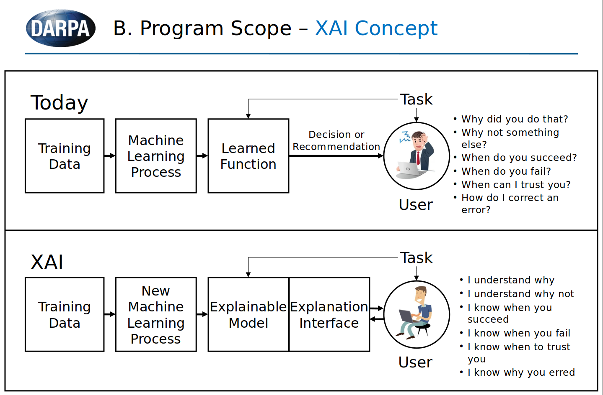
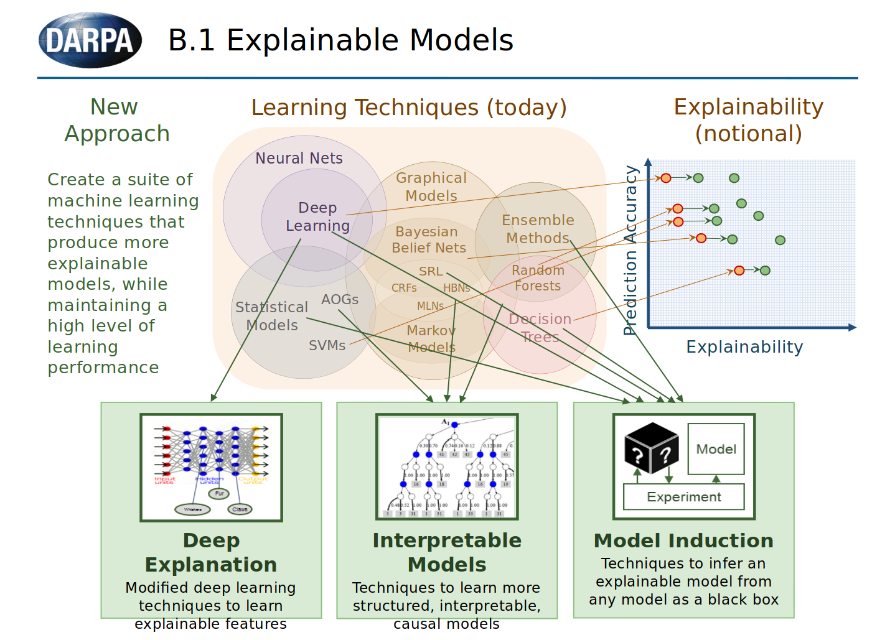
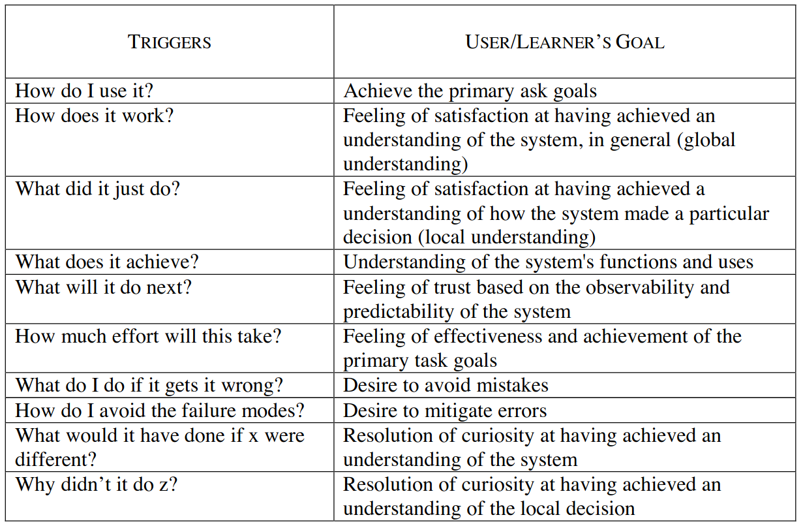

# Explainability

!!! Explainability

    The level to which a system can provideclarification for the cause of its decisions/outputs.

    Interpretability has become a well-recognized goal for machine learning models. The need for
    interpretable models is certain to increase as machine learning pushes further into domains such as
    medicine, criminal justice, and business, where such models complement human decision-makers and
    decisions can have major consequences on human lives. Transparency is thus required for domain
    experts to understand, critique, and trust models, and reasoning is required to explain individual
    decisions. [Sanjeeb et. Al](https://drive.google.com/drive/folders/1t74vQL453WeyKLj8fjkIAgBAiHjDUSbz)

## Introduction

"In many applications, trust in an AI system will come from its ability to ‘explain itself.’ Yet, when it comes to understanding and explaining the inner workings of an algorithm, one size does not fit all.Different stakeholders require explanations for different purposes and objectives, and explanations must be tailored to their needs. A physician might respond best to seeing examples of patient data similar to their patient’s. On the other hand, a developer training a neural net will benefit from seeing how information flows through the algorithm. While a regulator will aim to understand the system as a whole and probe into its logic, consumers affected by a specific decision will be interested only in factors impacting their case – for example, in a loan processing application, they will expect an explanation for why the request was denied and want to understand what changes could lead to approval. IBM Research is creating diverse explanations, including training highly optimized directly interpretable models, creating contrastive explanations of black box models, using information flow in a high-performing complex model to train simpler, interpretable classifiers, learning disentangled representations, and visualizing information flows in neural networks." [IBM](https://www.research.ibm.com/artificial-intelligence/trusted-ai/#)

## Key Takaways, Questions and Limitations

* *Key Takaways*
    * There is a tradeoff between explainability and accuracy (complex models with many features tend to be more accurate but at the same time less transparent)
    * The level of explainability is mainly dominated by its model type and the number of features it uses.
    * The importance of model explainability is highly dependent on the context of the model and its consequences. (Revenue, Rate, Rigour, Regulation, Reputation and Risk)
    * Almost every model can be implemented in a way that makes it explainable and no models are explainable by themself but need an additional layer for the translation of the results to make it explainable for endusers. 
    * Scenarios where explainability is important: Medical diagnosis, loan lending or general assisance in human desicion making. All scenarios are mainly about **classification models**.

* *Limitations*
    * The scope of explainability is not only defined by the model and data selection / pre processing 
but often has to be embedded in the application as a whole (Build an explianable AI system with an explanation userinterface for example)
    * Explainability needs to be accessible. Even models which would be interpretable need to have a method the extract these information and make the explantaion explicite.

* *Open Qustions*
    * How to treat techniques (from outside: model inducion, from inside: deep explanation) which enhance explainability in models which would be less explainable by nature? 
    * What should our score on explainability tell? How easily the model could be interpreted and an XAI system could be build with it?

## Summaries of Paper & Website

See all papers related to explainability from IBM here: [publications](https://www.research.ibm.com/artificial-intelligence/publications/?researcharea=explainability)

### [Explainable AI](https://www.pwc.co.uk/audit-assurance/assets/explainable-ai.pdf)

The paper is business oriented and talks about why explainability is an advatage to have embedded in AI
algorithms and in which usecases explainability should have a high priority. 

* (p.8) The need for Explainability: Working as intended?, How sensitive is the impact?, Are you comfortable with
the level of control?

* (p.9) factors to consider: Revenue, Rate, Rigour, Regulation, Reputation and Risk

* (p.12) Explainable by design: Explainability needs to be considered up front and embedded into the design of
the AI application. It affects the choice ofmachine learning algorithm and mayimpact the way you choose to pre-process data.

* (p.13) Trade-offs in explainability: Interpretability is a characteristic of a model that is generally considered to come at a cost. As a rule of thumb, the more complex the model, the more accurate it is, but the less interpretable it is. (Decision tree vs. DNN with many layers and features)

* (p.14) Differnt explaination techniques: Sensitivity analysis,Local Interpretable Model Explanations (LIME), Shapley Additive Explanations (SHAP), Tree interpreters, Neural Network Interpreters

* (Appendix 2)  Subjective scale of explainability of different classes of algorithms and learning techniques 
(with 1 being the most difficult and 5 being the easiest to explain) see a compriesed version of the table belwo:

| Learning technique              | Scale of explainability (1-5) |
|---------------------------------|:-----------------------------:|
| Bayesian belief networks (BNNs) |              3.5              |
| Decision trees                  |               4               |
| Logistic regression             |               3               |
| Support vector machines (SVMs)  |               2               |
| K-means clustering              |               3               |
| Neural networks                 |               1               |
| Random forest/boosting          |               3               |
| Q-learning                      |               2               |
| Hidden Markov models            |               3               |

 

### [Explainable Artificial Intelligence (XAI)](https://www.darpa.mil/program/explainable-artificial-intelligence) 

XAI is a project from Defense Advanced Research Projects Agency which aims to produce more explainable models, while maintaining a high level of learning performance (prediction accuracy)and enable human users to understand, appropriately trust, and effectively manage the emerging generation of artificially intelligent partners

see their concept here: [DARPA slide deck on explainability](https://www.darpa.mil/attachments/XAIIndustryDay_Final.pptx) (two key slides below)

See another slide deck on XAI with more examples here: [second XAI slide deck](https://drive.google.com/drive/folders/1t74vQL453WeyKLj8fjkIAgBAiHjDUSbz)

### [Improving transparency of models](https://drive.google.com/drive/folders/1t74vQL453WeyKLj8fjkIAgBAiHjDUSbz)

Context of AI applications were transparency and explainability is key: 
financial risk assessment (Goyal 2018), medical diagnosis and treatment
planning (Strickland 2019), hiring and promotion decisions
(Alsever 2017), social services eligibility determination
(Fishman, Eggers, and Kishnani 2019), predictive policing
(Ensign et al. 2017), and probation and sentencing recom-
mendations (Larson et al. 2016).

Recent work has outlined the need for increased transparency in AI for data sets(Gebru et al. 2018;
Bender and Friedman 2018; Holland et al. 2018), models (Mitchell et al. 2019),and services (Arnold et al. 2019).

### [Metrics for Explainable AI (XAI)](https://arxiv.org/pdf/1812.04608.pdf)

!!! Note
    
    Explaibale AI is much more than just having an easily interpretable model but about a whole system that 
    is able to explain itself and interact with the user to create a full unterstanding tailored to the user needs.

The papers elaborates metrics for the goodness of explanations, whether users are satisfied by explanations, how well  users  understand  the  AI  systems,  how  curiosity  motivates  the  search  for explanations, whether  the  user's  trust  and  reliance  on  the  AI  are  appropriate.

### [Interpretability to whome?](https://arxiv.org/pdf/1806.07552.pdf)

A machinelearning system’s interpretability should be de-fined in relation to a specific agent or task: we should not ask if the system is interpretable, but to whom is it interpretable

### [Explainability in image classification](https://www.research.ibm.com/artificial-intelligence/publications/paper/?id=Sanity-Checks-for-Saliency-Metrics)

Saliency maps are a popular approach to creating post-hoc explanations of image classifier outputs. These methods produce estimates of the relevance of each pixel to the classification output score, which can be displayed as a saliency map that highlights important pixels.

### [Towards A Rigorous Science of Interpretable Machine Learning](https://arxiv.org/pdf/1702.08608.pdf)

The need for interpretability stems  from  an incompleteness in  the  problem  formalization. Scensario where this can be the case:

* Scientific Understanding:  The human’s goal is to gain knowledge.  We do not have a completeway of stating what knowledge is;  thus the best we can do is ask for explanations we canconvert into knowledge.

* Safety:  For complex tasks,  the end-to-end system is almost never completely testable;  onecannot  create  a  complete  list  of  scenarios  in  which  the  system  may  fail.   Enumerating  allpossible outputs given all possible inputs be computationally or logistically infeasible, and wemay be unable to flag all undesirable outputs.

* Ethics:  The  human  may  want  to  guard  against  certain  kinds  of  discrimination,  and  theirnotion of fairness may be too abstract to be completely encoded into the system.  Even if we can encode protections for specific protected classes into the system, there might be biases that we did not consider a priori 

dimensions of interpretability:

* Global vs.  Local: Global interpretability implies knowing what patterns are present in general, while local interpretability implies knowing the reasons for a specific decision (such as why a particular loan application was rejected).The former may be important for when scientific understanding or bias detection is the goal;the latter when one needs a justification for a specific decision

* Area,  Severity of Incompleteness: What part of the problem formulation is incomplete, andhow incomplete is it?

* ime Constraints: How long can the user afford to spend to understand the explanation?  Adecision that needs to be made at the bedside or during the operation of a plant must beunderstood quickly, while in scientific or anti-discrimination applications, the end-user maybe willing to spend hours trying to fully understand an explanation.

* User Expertise: How experienced is the user in the task?

### [Comprehensible Classification Models](http://citeseerx.ist.psu.edu/viewdoc/download?doi=10.1.1.599.164&rep=rep1&type=pdf)

(p.2-5) Decision trees,  classification  rules,  decision  tables,  nearest  neighbors,  and Bayesian network classifiers, with respect to their interpretability

(p.6) The Drawbacks of Model Size as the Single Measure of Comprehensibility. Big decision trees with easily understandable features can be more comprehensible than small trees with less intuitive features. Models that are too small can also be to simple for users to accept and not lead to less comprehensibility and general trust in the model.

(p.7) Monotonicity Constraints in Classification Models. Users are more like to trust and accept classification models when they  are built by respecting monotonicity constraints in  the  application domain. A monotonic  relationship  between  a  feature and  the  class  attribute  occurs  when  increasing  the  value  of  the feature  tends  to  either  monotonically  increase  or  monotonically decrease the probability of an instance’s membership to a class

## Taxonomy

Construct a set of measurable metrict which can be used to calculate a score that should indicate how good the explainability of a model is. For The calculation of the score differnt weights can be assigned to the metrics. 

metrics where 5 is the best and 1 the worst: 

* Model type: Different between ML model types and assigne a score to each depending on how easily the result is to explain.
* Monotonicity: A score from 1 to 5 for indicating how many monotone attributes there are, the higher the fraction the better.
* Relevance: A score from 1 to 5 how relevant the attributes are. Ideally there are no irrelevant attributes (the definition of relevance depends on the model type)
* Model size: A score from 1 to 5 where bigger more complex models with many attributes have 

(new metric: uncorrelated dataset?)

### Model Type Scoring

There exist many different machine learning model and so does the interpretability of those models. The difficulty to explain a 
model decison is linked very closesly with the chosen model. 

Here a subjective score for the different learning algorithm classes based on the difficulty to decipher the decision of the model:

*well interpretable models*

*	Linear Regression: The weights of a linear model can be interpreted and 
the importance of a feature can be measured by the absolute value of its t-statistic.

*	

### Monotonicity

We can test a group of features for monotnicity constrainst with Verification-based testing.

[see this paper for algo](https://arxiv.org/pdf/2002.12278.pdf)

| metric     	| description 	| unit             	| weight 	|
|------------	|:-----------:	|------------------	|--------	|
| model type 	|        some models like linear regression or  decision tree are very explainable and models like neural networks less    	| [1,5] 	| 0.5      	|
|faithfulness relevance      	| are the features truly relevant or can some be omitted?       	|           [1,5]       	|    0.2    	|
| monotonicity 	| monotonic attribute functions most important feature for classification           	|           [1,5]       	|        0.2	|
| model size | more features add to the complexity and may decrease comprehensibility | [1,5] | 0.1

