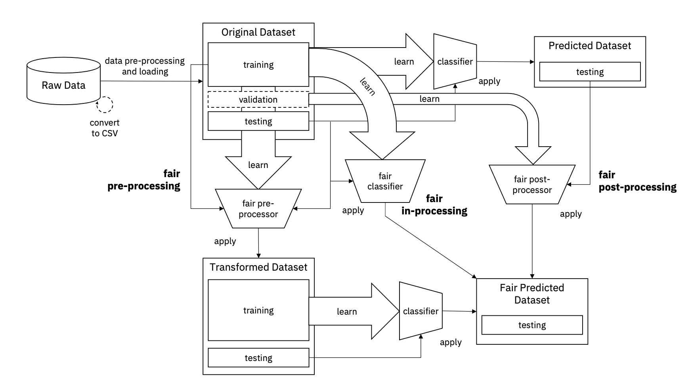
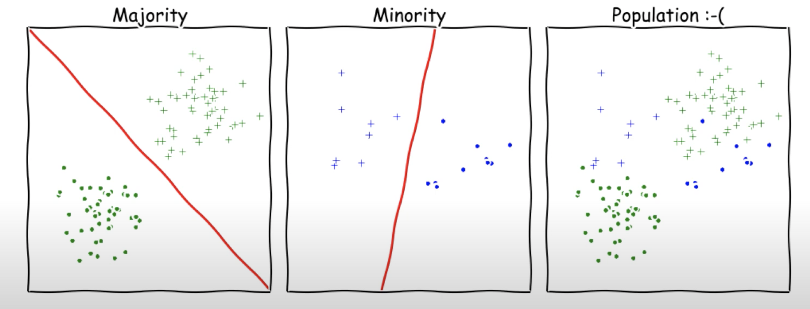

# Fairness
## Introduction
An increasing number of information systems take decisions based on statistical inference rules, acquired through machine learning techniques. Especially in decision-critical contexts such as predictive policing, lending decisions in credit scoring or triage and allocation of health care resources discrimination is to be avoided. In order to avoid encoding discrimination in automated decisions, multiple fairness aspects needs to be accounted for.

<!--##Definition-->

###Legally recognized 'protected classes'
Depending on the context the stakeholders need to decide during the model creation process which systemic difference between groups should be available to the model and which should be excluded. These sensitive features should either not be used or very carefully, since they are protected by law.

* Race (Civil Rights Act of 1964)
* Color (Civil Rights Act of 1964)
* Sex (Equal Pay Act of 1963; Civil Rights Act of 1964)
* Religion (Civil Rights Act of 1964)
* National Origin (Civil Rights Act of 1964)
* Citizenship (Immigration Reform and Control Act)
* Age (Age Discrimination in Employment Act of 1967)
* Pregnancy (Pregnancy Discrimination Act)
* Family Status (Civil Rights Act of 1968)
* Disability Status (Rehabilitation Act of 1973; Americans with Disabilities Act of 1990)
* Veteran Status (Vietnam Era Veterans Readjustment Assistance Act of 1974)
* Genetic Information (Genetic Information Nondiscrimination Act)
* Sexual orientation (in some jurisdications)

###Application Examples
1. **Medical Testing and Diagnosis**
	* Making decisions about a patient’s treatment may rely on tests providing probability estimates for different diseases and conditions.
	* Here too we can ask whether such decision-making is being applied uniformly across different groups of patients.
2. **Hiring**
3. **Lending**
4. **School Admission**
5. **Criminal Justice**

###Counterexamples
Examples of Algorithmic Unfairness

1. **COMPAS risk tool**
	* Assess a defendant’s probability of recidivism.
	* Want to keep 
	* Tool’s errors were asymmetric: African-American defendants were more likely to be incorrectly labeled as higher-risk than they actually were, while white defendants were more likely to be incorrectly labeled as lower-risk than they actually were.
	* White defendants who went on to commit future crimes were assigned risk scores corresponding to lower probability estimates in aggregate [5].
2. **Apple Credit Card**
	* Apple Card's Credit Scoring Algorithm was investigated after discriminating against women.
3. **Beauty AI Contest**
	* The first international beauty contest decided by an algorithm has sparked controversy after the results revealed that the algorithm discriminated against people of color [1].
4. **Google Advertising Discrimination**
	* A team of researchers form Carnegie Mellon university build a tool called AdFisher to automatically test the Google Adwords system.
	* They found out that women are much less likely to be shown ads for high paid positions [3].
5. **University Admission**
	* Universities are starting to use machine learning tools in order to predict which students are going to perform well.
	* This can potentially lead to a discrimination based on the students family background [4].
6. **Predictive Policing**
	* Violent crime is like a communicable disease, that it tends to break out in geographic clusters.
	* PredPol identifies areas in a neighborhood where serious crimes are more likely to occur during a particular period.  
	* The company claims its research has found the software to be twice as accurate as human analysts when it comes to predicting where crimes will happen [6]. 
7. **Amazon's AI Recruiting Engine**
	* Amazons recruiting engine discriminated against women.
	* Since most software developers at Amazon are male the system thought they are prefered over women.

### Sources of Bias
The term bias to refer to computer systems that systematically and unfairly discriminate against certain individuals or groups of individuals in favor of others. A system discriminates unfairly if it denies an opportunity or a good or if it assigns an undesirable outcome to an individual or group of individuals on grounds that are unreasonable or inappropriate. Consider, for example, an automated credit advisor that assists in the decision of whether or not to extend credit to a particular applicant. If the advisor denies credit to individuals with consistently poor payment records we do not judge the system to be biased because it is reasonable and appropriate for a credit company to want to avoid extending credit privileges to people who consistently do not pay their bills. In contrast, a credit advisor that systematically assigns poor credit ratings to individuals with ethnic surnames discriminates on grounds that are not relevant to credit assessments and, hence, discriminates unfairly. **Bias is systematic discrimination with an unfair outcome** [8].

Three categories of bias in computer systems

- Preexisting
	- Has its roots in social institutions, practices, and attitudes.
	- Can also reflect the personal biases of individuals who have significant input into the design of the system.
	- Can enter a system either through the explicit and conscious efforts of individuals or institutions, or implicitly and unconsciously, even in spite of the best of intentions.
- Technical
	- Arises from technical constraints or considerations.
	- E.g bias that originates from the use of an algorithm that fails to treat all groups fairly.
- Emergent
	- Arises in a context of use.
	- Typically emerges some time after a design is completed, as a result of changing societal knowledge, population, or cultural values

- If the system is complex, and most are, biases can remain hidden in the code.
- The distinction between a rationally based discrimination and bias is always easy to draw

-----
** Common types of bias in machine learning ** 

- **Automation bias**
	- When a human decision maker favors recommendations made by an automated decision-making system over information made without automation, even when the automated decision-making system makes errors.
- **Confirmation bias**
	- The tendency to search for, interpret, favor, and recall information in a way that confirms one's preexisting beliefs or hypotheses. Machine learning developers may inadvertently collect or label data in ways that influence an outcome supporting their existing beliefs
- **Experimenter’s bias**
	- Is a form of confirmation bias in which an experimenter continues training models until a preexisting hypothesis is confirmed.
- **Group attribution bias**
	- Assuming that what is true for an individual is also true for everyone in that group.
- **Implicit bias**
	- Automatically making an association or assumption based on one’s mental models and memories
- **In-group bias**
	- Showing partiality to one's own group or own characteristics. If testers or raters consist of the machine learning developer's friends, family, or colleagues, then in-group bias may invalidate product testing or the dataset
- **Out-group homogeneity bias**
	- Showing partiality to one's own group or own characteristics. If testers or raters consist of the machine learning developer's friends, family, or colleagues, then in-group bias may invalidate product testing or the dataset.
-----
- **Coverage bias**
	- The population represented in the dataset does not match the population that the machine learning model is making predictions about.
- **Non-response bias**
	- Also called participation bias.
	- Users from certain groups opt-out of surveys at different rates than users from other groups.
- **Reporting bias**
	- The fact that the frequency with which people write about actions, outcomes, or properties is not a reflection of their real-world frequencies or the degree to which a property is characteristic of a class of individuals. Reporting bias can influence the composition of data that machine learning systems learn from.
	- For example, in books, the word laughed is more prevalent than breathed. A machine learning model that estimates the relative frequency of laughing and breathing from a book corpus would probably determine that laughing is more common than breathing.
- **Sampling bias**
	- Data is not collected randomly from the target group.
- **Selection bias**
	- Errors in conclusions drawn from sampled data due to a selection process that generates systematic differences between samples observed in the data and those not observed.

### Sources of Unfairness
- Data Unfairness ... from Task Definition and Data Collection.
- Algorithmic Unfairness ... from Model Specification and Model Training.
- Impact Unfairness ... from Model Testing and Deployment in Real-World.

###Algorithmic Unfairness

- f∗,the underlying model (yi =f∗(xi)+εi).
- h∗ ∈ H, the best available hypothesis.
- h=argminh′∈HL(D,h′), the best model on finite sample.
- For the sake of concreteness, s ∈ {0, 1} is assumed.
- Unfairness = E[(h(x)−y)2|s=0] − E[(h(x)−y)2|s=1]

## Fairness Metrics
### within the ML Pipeline
{class=center width=512px}

#### 1. Business Understanding
*Ask relevant questions and define objectives for the problem that needs to be tackled.*

**Counter Examples**

- Inferring criminality using face images is unethical.
- Identifying gay faces is an unenthical use case.

#### 2. Data Mining
*Gather and scrape the data necessary for the project.*

- Mismatch between training and deployment populations (e.g Different population or drifting populations)

* Under/over-representation
* Less data from the minority (e.g., accents in speech recognition)
* Feedback loops (e.g observe if “paid back the loan” only if loan granted)

#### 3. Data Cleaning
*Fix the inconsistencies within the data and handle the missing values.*

* Class imbalance: The number of observations for each class deviates substantially from the proportions in the underlying population.
* Over- and Undersampling
* Unfairness from Underrepresentation

{: align=center}

#### 4. Data Exploration
*Form hypotheses about your defined problem by visually analyzing the data.*

#### 5. Feature Engineering
*Select important features and construct more meaningful ones using the raw data that you have.*

#### 6. Predictive Modeling
*Train machine learning models, evaluate their performance, and use them to make predictions.*

#### 7. Data Visualization
*Communicate the findings with key stakeholders using plots and interactive visualizations.*

#### 8. Deployment

- Unintended use or adversarial feedback (e.g Tay.ai)
- Gaming the system. Users can try to use the rules and procedures meant to protect the system, in order to instead, manipulate the system.

### Statistical Measures Of Fairness
The closer these values are to one the better the classifier.

**Positive Predicted Value (PPV)** 
How many of the samples that were classified as pos samples are actually pos samples. 
Also called precision. 
PPV = P(actual=+|prediction=+) = TP / (TP + FP) 

**False Discovery Rate (FDR)** 
The fractions of samples that got classified as pos samples but however actually are negative samples. 
FDR = P(actual=-|prediction=+) = FP / (TP + FP) 

**Negative Predicted Value (NPV)** 
NPV = P(actual=-|prediction=+) = TN / (TN + FN) 

**False Omission Rate (FOR)** 
FOR = P(actual=+|prediction=-) = FN / (TN + FN) 

**True Positive Rate (TPR)** 
Number of positive samples that got successfully identified as positives. 
Also called sensitivity or recall. 
TPR = P(prediction=+|actual=+) = TP / (TP + FN) 

**False Negative Rate (FNR)** 
Number of positive samples that accidentally got identified as negatives. 
FNR = P(prediction=-|actual=+) = FN / (TP + FN) 

**True Negative Rate (TNR)** 
TNR = P(prediction=-|actual=-) = TN / (TN + FP) 

**False Positive Rate (FPR)** 
FPR = P(prediction=+|actual=-) = FP / (TN + FP) 

###Overview
- (1) and (2) are widely used ideas inspired by anti-discrimnation legislation.
- There are group notions of fairness (e.g *statistical parity, equality of accuracy, equality of false positive/false negative rates*) and individual notions (e.g *treating similar individuals similar*).
- There is no universally accepted definition of fairness. The existing notions consider how errors are distributed across different groups.

#### Biased Data
During the data collection bias can be introduced. 
Selection bias for example could result in the data not being representative of the underlying population. 
Or depending on how certain questions are framed the results of a survey could also be different. 
However it is really difficult to automatically detect bias in data since you need to compare the data to something in order to identify deviations. 

**Sample Bias:** 
When the sample process generating the data is not uniform across protected groups.

**Label Bias:** 
We define ‘label bias’ as the case when there is a causal link between a protected attribute and the class label assigned to an individual which is not warranted by ground truth. Consider a dataset composed of elementary school students, with a dependent variable that indicates whether the student misbehaves. Studies have shown that Black and Latinx children are more likely than White children to receive suspensions or expulsions for similar problem behavior, so if our dataset’s dependent variable were based on suspensions it would contain label bias.

##### Simpson’s paradox
 Cases where different levels of data aggregation produce different fairness conclusions. An analysis of graduate admissions data from Berkeley offers one such case [1], in which the aggregate data show an admissions bias against women, but when the data are disaggregated to the department level the bias is reversed. This difficulty stems from the causal influence of the protected class (in this case gender) on the presence of an individual in the set of applicants to each department: women preferentially apply to departments with lower acceptance rates.

#### Class Imbalance
Imagine a dataset with 99% samples with label one and 1% samples with label zero. 
A classifier returning always one as the predicted label would still receive an accuracy of 99%.

#### Individual Fairness
* Treating people as individuals, regardless of their group membership.
* Similarity is defined with respect to the task at hand.
* Individual notions, while intuitively appealing, are hard to formalize (what is the right notion of benefit or distance?) and are computationally challenging.

**Formalizing Individual Fairness**

* d(xi, xj): a metric defining distance between two individuals.
* D: a measure of distance between distributions.
* A randomized classifier h : X → ∆(Y) satisfies the (D, d)-Lipschitz property if ∀xi , xj: D(∆h(xi), ∆h(xj)) ≤ L d(xi, xj) for a real number L > 0.
* This means that the differences in prediction between individuals need to be based on a well reasoned distance in the feature space with regard to the application context.
* How should we pick d, D and L?
* Does not treat dissimilar individuals differently.

**Unfairness as inequality of received benefit**

* Define the benefit obtained by each individual.
* $\forall\ individual\ i: b_i = \hat{y}_i - y_i + 1$
* Plug the different benefits into the inequality equation e.g Gini index.
* $G(b) = \frac{\Sigma_{i=1}^{n}\Sigma_{j=1}^{n}|b_i-b_j|}{2n \Sigma_{i=1}^{n}b_i}$

#### Group Fairness

####1. Disparate Treatment 
A practice that intentionally disadvantages/discriminates a group based on a protected feature (*e.g the pay difference between men and women at the same position, *). The treatment or process should not depend on a sensitive feature encoding group membership.

**How to check for Disparate Treatment**  
Depending on the context certain attributes are considered to be protected. For hiring decisions in Germany for example the exmployer is not allowed to use certain information e.g (pregnancy status, wish for a child, relationship status). The user of our tool could be presented with all attributes the model is taking into consideration. He could then select every attribute he would consider in this context. On the other hand side it would be possible to define a default list of protected attributes (gender, religion, race) and let their use negatively influence the fairness score.

####2. Disparate Impact 
Is what occurs when an organization’s actions, policies, or some other aspect of their processes inadvertently result in unintentional discrimination against people who are in a protected class. Even though the policy, action, or item in question would otherwise appear to be neutral. What matters is the outcome, not the intent. Equality in outcomes across groups based on protected features has to be assured.

**How to check for Disparate Impact**  

####3. Statistical Parity
In some cases statistical parity is a central goal (and in some it is legally mandated). Statistical parity, ensures that the overall proportion of members in a protected group receiving positive (negative) classification are identical to the proportion of the population as a whole.

> 
*“A selection rate for any race, sex, or ethnic group which is less than four-fifths (or 80%) of the rate for the group with the highest rate will generally be regarded by the Federal enforcement agencies as evidence of [discrimination].”* - **Equal Employment Opportunity Commission**
>

Certain definitions of fairness, and thus certain fairness metrics, are demonstrably inappropriate in particular circumstances. For example, if there is a legitimate reason for a difference in the rate of positive labels between members of different protected classes (e.g. incidence of breast cancer by gender) then statistical parity between model results for the protected classes would be an in- appropriate measure

A classifier h satisfies demographic parity under a distribution over (X, A, Y ) if its prediction $h(X)$ is statistically independent of the protected attribute A—that is, if $P[h(X) = \hat{y} | A=a]=P[h(X)=\hat{y}]\ \forall a,\hat{y}$. Because $\hat{y}∈{0,1}$, this is equivalent to $E[h(X) | A = a] = E[h(X)]$ for all a.

**Equal selection rates across different groups** 
P[y_pred = 1|s1] = P[y_pred = 1|s2]

**Equality of the prediction accuracy across groups** 
E[l(y_pred, y)|s1] = E[l(y_pred, y)|s2]

####4. Envy Free Fairness
In an envy free assignment every individual does not want to receive the anothers' assignment. E.g cake cutting where the slices have equal size.
The concept of envy free fairness is closesly linked to **pareto optimality**.

####5. Disparate Mistreatment
Classifier might make decisions for people belonging to different social groups with different misclassification rates. When the ground truth for historical decisions is available, disproportionately beneficial outcomes for certain sensitive attribute value groups can be justified and explained by means of the ground truth. Therefore, disparate impact would not be a suitable notion of unfairness in such scenarios. Disparate Mistreatment arises when the false positive rates (FPR) and false negative rates (FNR) are substantially different between groups. Avoiding Disparate Mistreatment requires to establish **Group Error Parity** For this the prediction error (FPR, FNR) should be similar across groups and therefore independant of protected feature
Es=0[f(x,s), y] = Es=1[f(x,s), y]

####6. Equalized Odds
Demographic parity rules out perfect classifiers whenever Y is correlated with A.

A classifier h satisfies equalized odds under a distribution over $(X,A,Y)$ if its prediction $h(X)$is conditionally independent of the protected attribute A given the label Y —that is, if $P[h(X)=\hat{y}|A=a,Y =y] = P[h(X)=\hat{y}|Y=y] \forall a, y, and\ \hat{y}$. Because $\hat{y} ∈ {0, 1}$, this is equivalent to $E[h(X)|A=a,Y =y]=E[h(X)|Y=y]\ \forall a,y$.

## Fairness Mechanisms
Fairness constraints and mechanisms have to be weighted against a loss in accuracy.

### Pre-processing 
Pre-processing the data.

### In-processing
$min_{h' \in H} L(h', D)$ 
$s.t\ F(h', D)$ 
Choose the model h' that minimizes the prediction loss while respecting the fairness constraints.
### Post-processing
Post-processing the classifier’s predictions.

## Process
1. Let the user select the variables that he considers to be protected from the training dataset.
2. Some metrics need to be scored by the user. For example the proper class balance and for example the question if the problem or question the model is trying to solve or predict is very hard to be assessed automatically. Therefore the user scores that fairness on a level from [0,1] or [0,100].
3. Compute metrics based on the protected attributes for example group fairness, disparate treatment score, disparate impact score etc.
4. Based on the taxonomy an overall fairness score can then be created.

##Taxonomy
| **Stage** | **Metric** | **Target** | **Description** | **Unit** | **Weight** |
|---|---|---|---|---|---|
|** *1. Business Understanding* **|*Question Fairness*|Problem Context| Is the question we are trying to answer fair in itself? It would be considered fair to recommend a preferred treatment to a patient, but the application of machine learning for racial profiling would be considered unfair.|[0,1]|1/n|
||*Context Criticality*|Problem Context| How important is fairness in the context the model operates in? In a legal context fairness is very important while it is less important for marketing purposes.|[0,1]|1/n|
|** *2. Data Mining* **|*Biased Data*|Dataset|Does the data possibly contain a bias which was introduced during the data collection? (e.g selection bias)|{0,1}|1/n|
|** *3. Data Cleaning* **|*Class Balance/ Imbalance*|Dataset| To what degree does the sample (training dataset) represent the expected class distribution of the real underlying population?|[0,1]|1/n|
|** *4. Data Exploration* **|-|-|-|-|-|
|** *5. Feature Engineering* **|-|-|-|-|-|
|** *6. Predictive Modeling* **|*Equally Distributed Precision*|Model|What fraction of predictions as a positive class were actually positive.  Precision: TP/(TP+FP)|[0,1]|1/n|
||*Equally Distributed Recall*|Model|What fraction of all positive samples were correctly predicted as positive by the classifier.  Recall: TP/(TP+FN).|[0,1]|1/n|
||*Equally Distributed Specificity*| Model | What fraction of all negative samples are correctly predicted as negative by the classifier.  Specificity: TN/(TN+FP).|[0,1]|1/n|
||*Equally Distributed F1 Score*|Model|F1 = 2*(precision * recall)/(precision + recall)|[0,1]|1/n|
||*Disparate Treatment*|Model|Depending on the context certain features (gender, religion, race) are considered to be protected. Is at least one protected feature used during the training process for the model's prediction?|[0,1]|1/n|
||*Disparate Impact*|Model|A practice that intentionally disadvantages/discriminates a group based on a protected feature (e.g the pay difference between men and women at the same position, ). The treatment or process should not depend on a sensitive feature encoding group membership.|[0,1]|1/n|
||*Disparate Mistreatment*|Model|Check if the prediction error (FPR, FNR) is similar across groups and therefore independant of protected features Es=0[f(x,s), y] = Es=1[f(x,s), y]|[0,1]|1/n|
||*Statistical Parity*|Model|Statistical parity, ensures that the overall proportion of members in a protected group receiving positive (negative) classification are identical to the proportion of the population as a whole.|[0,1]|1/n|
|** *7. Data Visualization* **|-|-|-|-|

## Sources
### Papers
| Year | Author | Title | Context | Content | Link
|---|---|---|---|---|---|
|2012|Martin Glaser|"Racial profiling is a discriminatory practice that undermines fundamental civil rights while failing to promote law enforcement goals"|Racial Profiling|Racial profiling is of unjust nature|-|
|2015|Amit Datta|"Automated Experiments on Ad Privacy Settings"|Advertising|- Setting the gender to famel results in getting fewer instances of an ad related to high paying jobs than setting it to male.  - The amoral status of an algorithm does not negate its effects on society. - Manifold interactions can lead to discrimination, whereby not one party can be blamed solely.|-|
| 2016 | John Kleinberg |"Inherent Trade-Offs in the Fair Determination of Risk Scores"|Law Healthcare|- Three fairness notions are developed and it is shown that under non trivial conditions it is impossible to satisfy all three simultaneously.|-|
|2016|Muhammad Zafar|"Fairness Beyond Disparate Treatment & Disparate Impact: Learning Classification without Disparate Mistreatment"|||-|
| 2019 | Ziad Obermeyer | Dissecting racial bias in an algorithm used to manage the health of populations |Healthcare| - Show that a widely used algorithm, typical of this industry-wide approach and affecting millions of patients, exhibits significant racial bias. - At a given risk score, Black patients are considerably sicker than White patients, as evidenced by signs of uncontrolled illnesses.|-|
|2018|Alekh Agarwal|A Reductions Approach to Fair Classification|Fairness Mechanisms|Reduce fair classification to a sequence of cost-sensitive classification problems.|[[9]](https://arxiv.org/pdf/1803.02453.pdf)|

### Websites
- [1]- Sam Levin - [A beauty contest was judged by AI and the robots didn't like dark skin](https://www.theguardian.com/technology/2016/sep/08/artificial-intelligence-beauty-contest-doesnt-like-black-people) (2019)
- [2] - Robert Hart - [If you’re not a white male, artificial intelligence’s use in healthcare could be dangerous](https://qz.com/1023448/if-youre-not-a-white-male-artificial-intelligences-use-in-healthcare-could-be-dangerous/) (2017)
- [3] - Samuel Gibbs - [Women less likely to be shown ads for high-paid jobs on Google, study shows](https://www.theguardian.com/technology/2015/jul/08/women-less-likely-ads-high-paid-jobs-google-study) (2015)
- [4] - Neal Ungeleider - [Colleges Are Using Big Data To Predict Which Students Will Do Well–Before They Accept Them](https://www.fastcompany.com/3019859/colleges-are-using-big-data-to-predict-which-students-will-do-well-before-the)
- [5] - Julia Angwin - [There’s software used across the country to predict future criminals. And it’s biased against blacks.](https://www.propublica.org/article/machine-bias-risk-assessments-in-criminal-sentencing)
- [6] - Randy Rieland - [Artificial Intelligence Is Now Used to Predict Crime. But Is It Biased?](https://www.smithsonianmag.com/innovation/artificial-intelligence-is-now-used-predict-crime-is-it-biased-180968337/)
- [7] - Jeffrey Dastin - [Amazon scraps secret AI recruiting tool that showed bias against women](https://www.reuters.com/article/us-amazon-com-jobs-automation-insight-idUSKCN1MK08G)
- [8] - Batya Friedman - [Bias in Computer Systems](https://nissenbaum.tech.cornell.edu/papers/Bias%20in%20Computer%20Systems.pdf)
