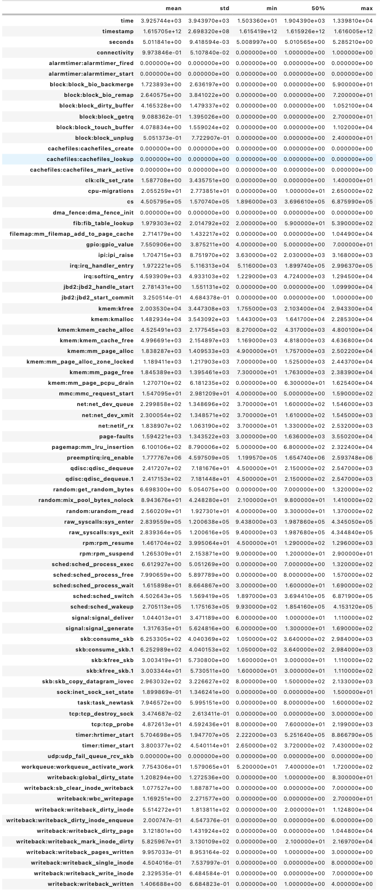

# Dr. Alberto Huertas Research on IT-Security

The data was collected using the Linux *perf* tool.

| Id | Feature | Description |
|---|---|---|
|1.|**'time'**|-|
|2.|**'timestamp'**|Timestamp when the event took place.|
|3. |**'seconds'**|-|
|4.|**'connectivity'**|Does this mean the network connection was up during that period?|
|5.|**'alarmtimer:alarmtimer_fired'**|An alarm was fired?|
|6.|**'alarmtimer:alarmtimer_start'**|A timer was started?|
|7.|**'block:block_bio_backmerge'**|Disk event. Did a bio_backmerge event happen?|
|8.|**'block:block_bio_remap'**|An operation for a logical device has been mapped to a raw block device.|
|9.|**'block:block_dirty_buffer'**|Software defined kernel event. Signals that the buffer has been written to.|
|10.|**'block:block_getrq'**|Tracepoint event|
|11.|**'block:block_touch_buffer'**|Gets triggered on
touch_buffer() event|
|12.|**'block:block_unplug'**|-|
|13.|**'cachefiles:cachefiles_create'**|New cachefile was created|
|14.|**'cachefiles:cachefiles_lookup'**|-|
|15.|**'cachefiles:cachefiles_mark_active'**|-|
|16.|**'clk:clk_set_rate'**|-|
|17.|**'cpu-migrations'**|-|
|18.|**'cs'**|-|
|19.|**'dma_fence:dma_fence_init'**|-|
|20.|**'fib:fib_table_lookup'**|-|
|21.|**'filemap:mm_filemap_add_to_page_cache'**|-|
|22.|**'gpio:gpio_value'**|-|
|23.|**'ipi:ipi_raise'**|-|
|24.|**'irq:irq_handler_entry'**|-|
|25.|**'irq:softirq_entry'**|-|
|26.|**'jbd2:jbd2_handle_start'**|-|
|27.|**'jbd2:jbd2_start_commit'**|-|
|28.|**'kmem:kfree'**|-|
|29.|**'kmem:kmalloc'**|-|
|30.|**'kmem:kmem_cache_alloc'**|-|
|31.|**'kmem:kmem_cache_free'**|-|
|32.|**'kmem:mm_page_alloc'**|-|
|33.|**'kmem:mm_page_alloc_zone_locked'**|-|
|34|**'kmem:mm_page_free'**|-|
|35.|**'kmem:mm_page_pcpu_drain'**|-|
|36.|**'mmc:mmc_request_start'**|-|
|37.|**'net:net_dev_queue'**|-|
|38.|**'net:net_dev_xmit'**|-|
|39.|**'net:netif_rx'**|-|
|40.|**'page-faults'**|-|
|41.|**'pagemap:mm_lru_insertion'**|-|
|42.|**'preemptirq:irq_enable'**|-|
|43.|**'qdisc:qdisc_dequeue'**|-|
|44.|**'qdisc:qdisc_dequeue.1'**|-|
|45.|**'random:get_random_bytes'**|-|
|46.|**'random:mix_pool_bytes_nolock'**|-|
|47.|**'random:urandom_read'**|-|
|48.|**'raw_syscalls:sys_enter'**|-|
|49.|**'raw_syscalls:sys_exit'**|-|
|50.|**'rpm:rpm_resume'**|-|
|51.|**'rpm:rpm_suspend'**|-|
|52.|**'sched:sched_process_exec'**|-|
|53.|**'sched:sched_process_free'**|-|
|54.|**'sched:sched_process_wait'**|-|
|55.|**'sched:sched_switch'**|-|
|56.|**'sched:sched_wakeup'**|-|
|57.|**'signal:signal_deliver'**|-|
|58.|**'signal:signal_generate'**|-|
|59.|**'skb:consume_skb'**|-|
|60.|**'skb:consume_skb.1'**|-|
|61.|**'skb:kfree_skb'**|-|
|62.|**'skb:kfree_skb.1'**|-|
|63.|**'skb:skb_copy_datagram_iovec'**|-|
|64.|**'sock:inet_sock_set_state'**|-|
|65.|**'task:task_newtask'**|-|
|66.|**'tcp:tcp_destroy_sock'**|-|
|67.|**'tcp:tcp_probe'**|-|
|68.|**'timer:hrtimer_start'**|-|
|69.|**'timer:timer_start'**|-|
|70.|**'udp:udp_fail_queue_rcv_skb'**|-|
|71.|**'workqueue:workqueue_activate_work'**|-|
|72.|**'writeback:global_dirty_state'**|-|
|73.|**'writeback:sb_clear_inode_writeback'**|-|
|74.|**'writeback:wbc_writepage'**|-|
|75.|**'writeback:writeback_dirty_inode'**|-|
|76.|**'writeback:writeback_dirty_inode_enqueue'**|-|
|77.|**'writeback:writeback_dirty_page'**|-|
|78.|**'writeback:writeback_mark_inode_dirty'**|-|
|79.|**'writeback:writeback_pages_written'**|-|
|80.|**'writeback:writeback_single_inode'**|-|
|81.|**'writeback:writeback_write_inode'**|-|
|82.|**'writeback:writeback_written'**|-|