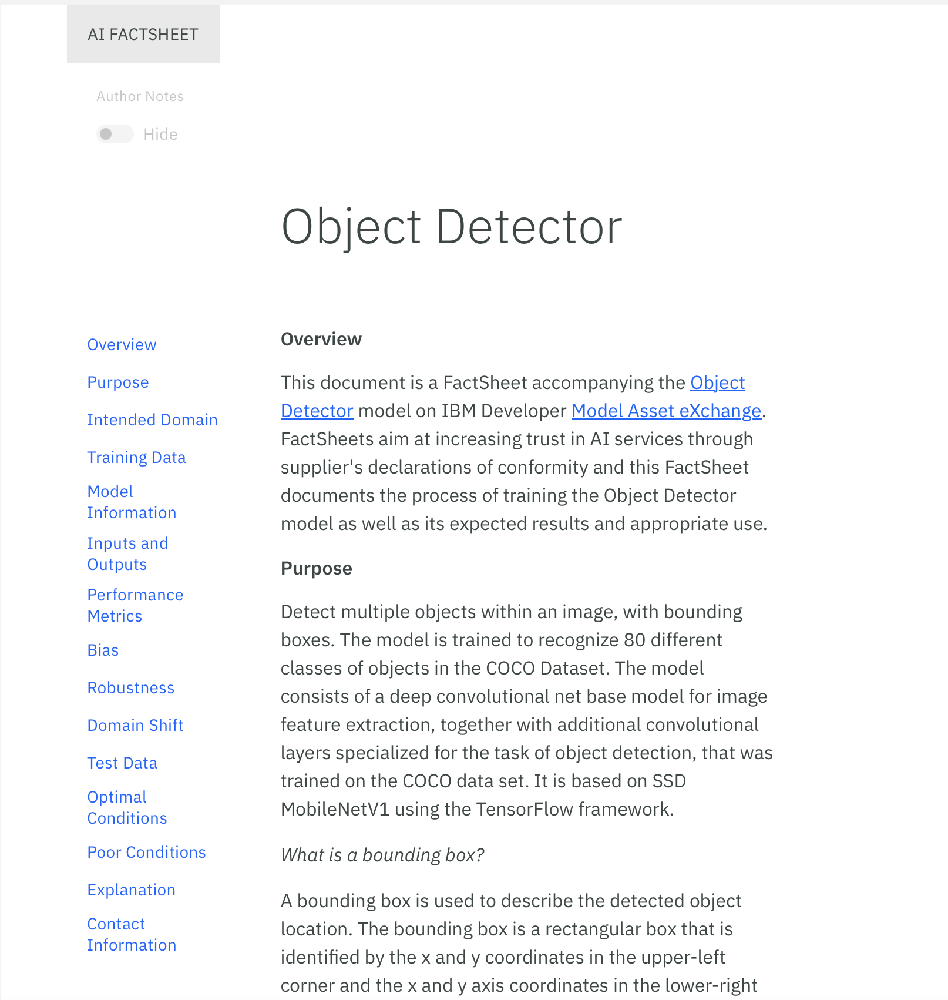
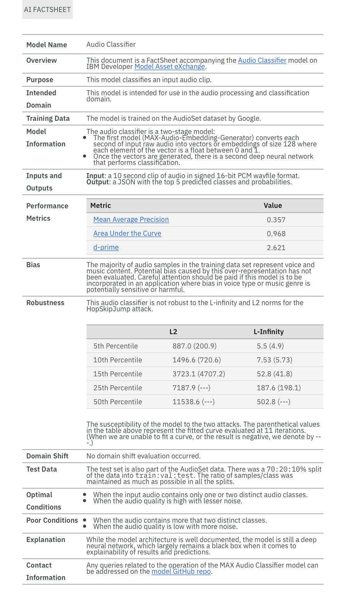

#IBM AI FactSheets 360
## Introduction
The goal of the FactSheet project is to foster trust in AI by increasing transparency an increased understanding of how AI was created and deployed and enabling governance the ability to control how AI is created and deployed. Increased transparency provides information for AI consumers to better understand how the AI model a program component that is generated by learning patterns in training data to make predictions on new data, such as a loan application. or service an executable program, deployed behind an API, that allows it to respond to program requests from other programs or services was created. This allows a consumer of the model to determine if it is appropriate for their situation.

### What is a FactSheet?
* Is a collection of relevant information about the creation and deployment of an AI model or service. 
* Such facts can be the purpose, criticality, performance, measured dataset and model characteristics (e.g accuracy).
* Every stakeholder might contribute facts about the model (data collector, model creator, model validator).
* The fact sheet documents the construction process of the model similar to a transcript of records providing insights about a student. Modeled after a supplier’s declaration of conformity. Since they are tailored to a particular Ai service or model they might vary in content.

* The format can be differently for different audiences (e.g Full, tabular, slides)
* Contains information about how the model was created, tested, trained, deployed and evaluated.
* What legislation (e.g GDPR) or company rules (e.g what features can not be used) need to be accounted for.

####Why do we need FactSheets?
* Many stakeholders are involved in the model creation process (e.g In the 

###Structure of a FactSheet

* The structure is customizable for varying audiences (internal, external stakeholders).

* Fact Sheet Examples can be found here (https://aifs360.mybluemix.net/examples)

{class=center width=384px}
{class=center width=384px}
{class=center width=384px}

##Taxonomy
| **Stage** | **Metric** | **Description** | **Unit** | **Weight** |
|---|---|---|---|---|
|-|-|-|-|-|

##References
[1] - **Matthew Arnold** - *"FactSheets: Increasing Trust in AI Services through Supplier's Declarations of Conformity"*